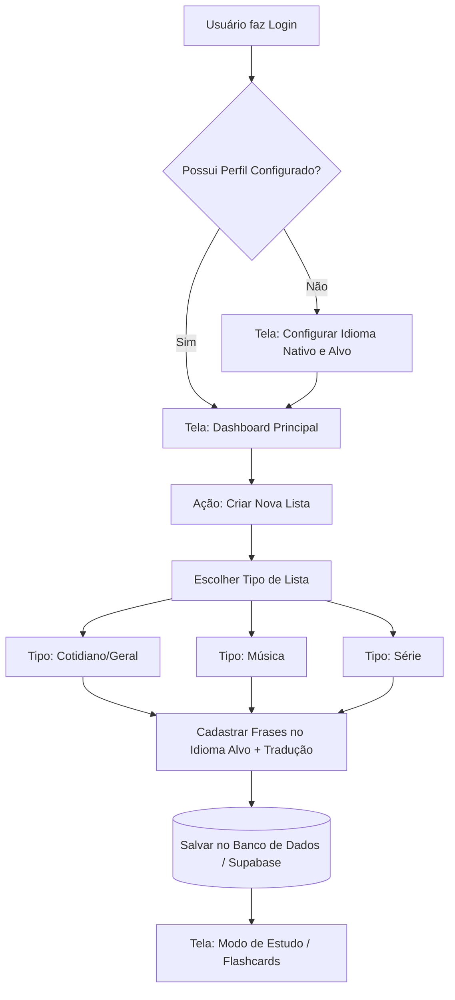

# 🎙️ SpeakEasy Fluent

## *Aprenda qualquer idioma. Crie suas próprias frases. Evolua no seu ritmo.*


---

## 🧠 O que é o SpeakEasy Fluent?

Diferente de aplicativos tradicionais que te forçam a seguir um currículo engessado, **SpeakEasy Fluent** te dá o poder de **criar seu próprio material de estudo**.

> 🇯🇵 Um japonês quer aprender inglês? ✅  
> 🇧🇷 Um brasileiro quer aprender coreano? ✅  
> 🇫🇷 Um francês quer aprender espanhol? ✅  

**Você escolhe o tema, você cria as frases, você define a velocidade.**

Você pode escolher cadastrar a tradução ou pôr o sentido da frase no uso real!

---

## 🎯 Filosofia do Projeto

| Abordagem tradicional | SpeakEasy Fluent |
|----------------------|------------------|
| "The book is on the table" | Frases que você realmente vai usar |
| Currículo fixo | Você cria seus temas |
| Apenas inglês | Qualquer idioma funciona |
| Passivo | Leia em VOZ ALTA, treine pronúncia |
| Sotaque perfeito? | **Fluência real > Sotaque** |

> **"Aprenda como uma criança: ouça, repita, internalize em qualquer lugar."**

---

## ✨ Funcionalidades (agora e no futuro)

### 🟢 Já funcionando

- **📋 Listas por tema**  
  Crie temas ("No restaurante", "Reunião de trabalho", "Gírias americanas")

- **📜 Modo Scroll**  
  Frases rolando na tela. Leia em voz alta. Aumente a velocidade gradualmente.

- **⏯️ Controles completos**  
  Play, Pause, Reset + velocímetro ajustável (do mais lento ao mais rápido)

- **🔤 Tradução opcional**  
  Mostra ou esconde a tradução com um clique

- **🔊 Modo Áudio (beta)**  
  Ouça a frase no idioma alvo → tradução → repetição

### 🔮 Planejado

- [ ] Cadastro de usuário com perfil
- [ ] Criar suas PRÓPRIAS frases (frontend + backend)
- [ ] Banco de dados pessoal por usuário
- [ ] Modo "flip card" para memorização
- [ ] Estatísticas de progresso
- [ ] Compartilhar listas entre usuários
- [ ] Opções de vozes de idiomas

---

## 🚀 Como usar (agora)

### 1. Clone o projeto

```bash
git clone https://github.com/seu-usuario/speakeasy-fluent.git
cd speakeasy-fluent


---

speakeasy-fluent/
├── index.html              # Tela inicial
├── study-list.html         # Escolha o tema
├── study-detail.html       # Veja as frases do tema
├── mode-scroll.html       # Modo rolagem
├── study-audio.html        # Modo áudio
├── css/
│   └── styles.css
├── js/
│   ├── app.js              # Dados e lógica central
│   ├── study-list.js
│   ├── study-detail.js
│   ├── mode-scroll.js     # ★ Modo scroll (seu favorito)
│   └── study-audio.js
└── data/
    └── frases.json         # Suas listas de frases
```

---

## 📝 Como criar suas próprias frases (agora via JSON)

### frase.idioma_alvo

Pendente...

### frase.idioma_nativo native_text

Pendente...

## 🤝 Como contribuir (para o futuro)

Faça um fork

Crie uma branch: git checkout -b feature/nova-feature

Commit: git commit -m 'feat: adiciona nova feature'

Push: git push origin feature/nova-feature

Abra um Pull Request

📄 Licença
MIT — use, modifique, compartilhe. Só não esquece de dar os créditos 😉

💬 Contato
Projeto pessoal para aprendizado real de idiomas.
Sugestões? Críticas? Frases novas? Abra uma issue!

⭐ Se gostou da ideia, deixa uma estrela no repositório!

Made with ☕ and lots of reading out loud

## ⚠️ Disclaimer / Aviso Legal

**Este projeto é uma ferramenta de estudo PESSOAL e CUSTOMIZÁVEL.**

- Todo o conteúdo (frases, traduções, expressões) é **inserido exclusivamente pelo usuário**.
- O projeto **não oferece, não valida e não certifica** qualquer conteúdo como gramaticalmente correto, formal ou adequado para qualquer fim específico.
- O usuário é **integralmente responsável** pela veracidade, correção gramatical, adequação cultural e legal de TODAS as frases que cadastrar.
- Este projeto **não substitui professores, cursos ou materiais oficiais** de aprendizado de idiomas.
- O autor **não se responsabiliza** por:
  - Erros gramaticais, gírias mal interpretadas ou expressões incorretas inseridas pelo usuário
  - Ofensas, conteúdo impróprio ou qualquer material cadastrado por terceiros
  - Mau uso da ferramenta como fonte de ensino formal ou certificação
  - Danos diretos ou indiretos decorrentes do uso das frases cadastradas

**Ao utilizar este projeto, você concorda que é o único responsável pelo conteúdo que cria, armazena e estuda.**

## 🎯 Funcionalidades avançadas (em desenvolvimento)

### 🔄 Modo Maratona

*Estude todas as listas em sequência, sem interrupções.*

Ideal para:

- Treinos no ônibus ou metrô 🚆
- Revisão geral antes de uma viagem ✈️
- Imersão rápida de 15-30 minutos ⏱️

> Basta clicar em "Iniciar Maratona" na página de listas e escolher o modo (scroll ou áudio).

### 🔇 Modo só inglês no áudio

*Quando você já estiver confiante, desative a tradução e treine apenas com o idioma alvo.*

✔️ Ideal para nível intermediário/avançado  
✔️ Treina escuta ativa sem muletas  
✔️ Mais próximo da experiência real

---

## 📊 Estatísticas atuais

- **15 temas** organizados por situação real
- **+80 frases nativas** (e crescendo!)
- **Tempo médio por lista:** 5-10 minutos
- **Meta:** 30 minutos de maratona completa

---

## ✅ Status do projeto (MVP)

### Totalmente funcional

- ✅ Modo Scroll (lista única)
- ✅ Maratona Scroll (todas as listas)
- ✅ Cards responsivos (4/3/1 colunas)
- ✅ Toggle de tradução (scroll)
- ✅ Controles Play/Pause/Reset
- ✅ GitHub Pages funcionando (web + mobile)

### Parcialmente funcional

- 🟡 Modo Áudio (requer tela ativa)
- 🟡 Velocidade padrão (ajustando)

### Em desenvolvimento

- 🔄 Maratona Áudio
- 🔄 Contador de frases
- 🔄 Scroll infinito sem delay

### Próximos passos

- 📝 Suporte a músicas/trechos
- 🎙️ Backend para criar listas
- 🔇 Áudio em background

### Desenho de Fluxo de Navegação (Teste de Gráfico)

### 🎨 Desenhando os Fluxos com Mermaid (Cole no seu GitHub)

Copie o código abaixo e cole no seu README.md ou em uma Issue de Arquitetura. O GitHub vai renderizar um mapa visual dos caminhos do seu aplicativo para você nunca mais ter que reexplicar isso para as IAs:


